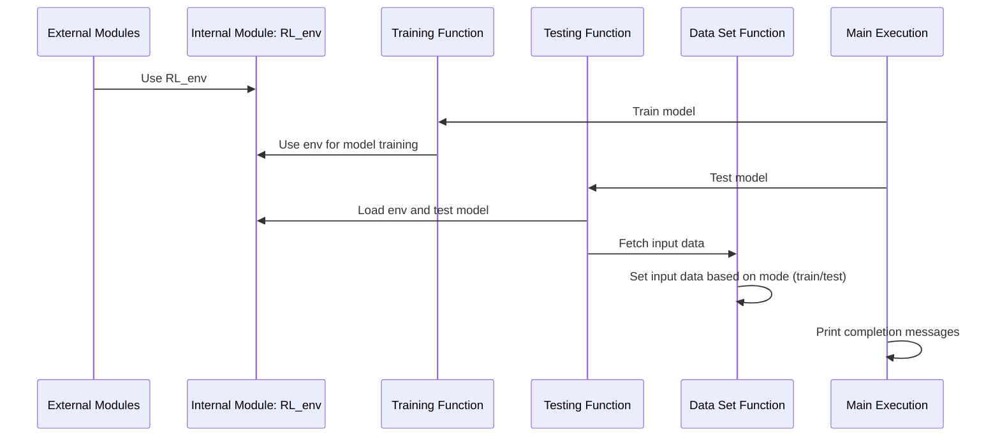

```mermaid
sequenceDiagram
    participant Import as External Modules
    participant Custom as Internal Module: RL_env
    participant Training as Training Function
    participant Testing as Testing Function
    participant Data as Data Set Function
    participant Main as Main Execution
    
    Import->>Custom: Use RL_env
    Main->>Training: Train model
    Training->>Custom: Use env for model training
    Main->>Testing: Test model
    Testing->>Custom: Load env and test model
    Testing->>Data: Fetch input data
    Data->>Data: Set input data based on mode (train/test)
    Main->>Main: Print completion messages

```
