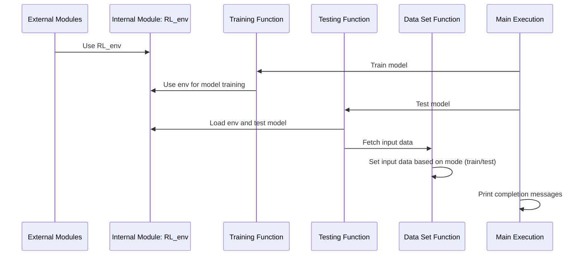

コードの概要 (Code Overview)  
- 外部モジュール: このコードは、gym, torch などの外部ライブラリやモジュールをインポートします。  
- 内製モジュール: RL_envという内部モジュールもインポートされています。  
- モデルのトレーニング: train関数はモデルの設定とトレーニングを担当します。この関数内で、PPO (Proximal Policy Optimization) モデルが初期化され、トレーニングされます。  
- モデルのテスト: test関数では、事前にトレーニングされたPPOモデルをロードし、テストします。  
- 入力データの設定: data_set関数は入力データの準備と設定を行います。この関数の動作はモード (trainまたはtest) によってわずかに異なります。  
- 実行部分: メインの実行部分であるif __name__ == "__main__":内で、まずモデルがトレーニング関数を使ってトレーニングされ、次にテスト関数を使ってテストされます。  
